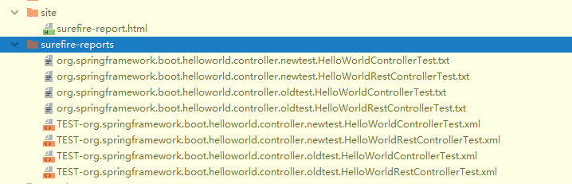
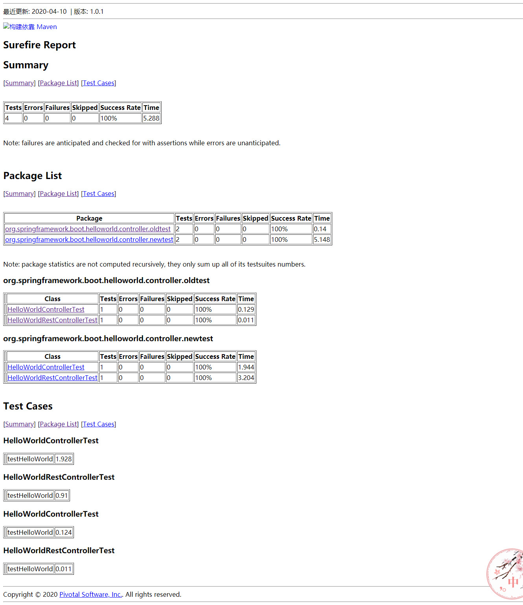
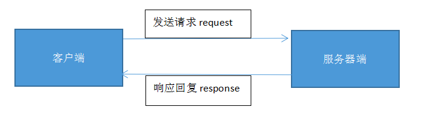
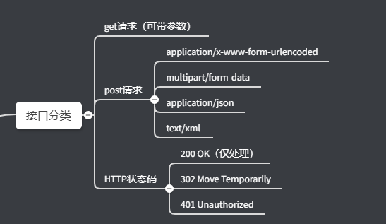
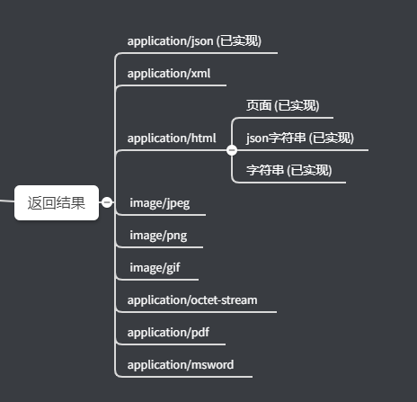
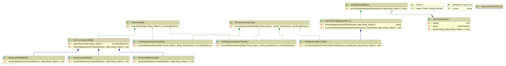

# 项目说明

这是spring boot junit 测试例子
## 运行环境
jdk 1.7 <br/>
maven   <br/>
spring boot版本 1.7 
idea

## HelloWorldSpringBoot 项目

是一个业务测试应用（Springboot+thymeleaf 开发）

IDEA直接运行 org.springframework.boot.helloworld.Application
* 首页 http://localhost:8080/
*restful接口：   http://localhost:8080/view/helloWorld
* view页面url ： http://localhost:8080/restful/helloWorld

## JunitTest项目
提供Junit测试相关工具类 <br/>
目前版本是 1.0.1

### 步骤
* 1 下载源码 进行maven build
* 2 pom.xml需要引入
```
        <dependency>
            <groupId>org.springframework.boot</groupId>
            <artifactId>JunitTest</artifactId>
            <version>${junitTest.version}</version>
            <scope>test</scope>
        </dependency>
```
* 3 新建BaseTest
```
//Application.class 换成你的项目SpringBoot启动类
@SpringBootTest(classes = Application.class)
// 继承 org.springframework.boot.junittest.AbstractBaseJunit
public class BaseTest extends AbstractBaseJunit {}
```
* 4 例如测试 接口地址返回view 页面<br/>
> 源接口地址代码：
```
@Controller
@RequestMapping("view")
/**
 * HelloWorld  controller
 * @author  xiaowen
 */
public class HelloWorldController {

    @RequestMapping("/helloWorld")
    public String helloWorld(Model model){
        model.addAttribute("value","helloWorld");
        return "helloWorld";
    }
}
```
> 使用JunitTest 创建测试代码
```
/**
 *
 * HelloWorld Testcontroller
 *
 * @Author xiaowen
 */
public class HelloWorldControllerTest extends BaseTest {
    /**
     * url地址返回view页面例子
     * 
     * @See org.springframework.boot.helloworld.controller.HelloWorldController.helloWorld
     * @throws Exception
     */
    @Test
    public void testHelloWorld() throws Exception {
        Map<String, Object> resultMatchersMap = new HashMap<String, Object>();
        //检查 页面是否 helloWorld
        resultMatchersMap.put(SystemConstant.VIEW_NAME, "helloWorld");
        //检查Model对象属性value 值是否是helloWorld
        resultMatchersMap.put("value", "helloWorld");
        //请求地址
        this.postUrl("/view/helloWorld", resultMatchersMap);
    }
}
```
> 原生测试API发放
```
@RunWith(SpringRunner.class)
@SpringBootTest(classes = Application.class)//这里的Application是springboot的启动类名
@WebAppConfiguration
public class HelloWorldControllerTest {

    protected static final String ENCODING = "UTF-8";
    @Autowired
    private WebApplicationContext context;

    private MockMvc mockMvc;

    @Before
    public void setupMockMvc() throws Exception {
        mockMvc = MockMvcBuilders.webAppContextSetup(context).build();
    }

    @Test
    public void testHelloWorld() throws Exception {
        ResultActions resultActions = mockMvc.perform(post("/view/helloWorld").characterEncoding(ENCODING));
        resultActions.andDo(print());
        resultActions.andExpect(status().isOk());
        resultActions.andExpect( MockMvcResultMatchers.view().name("helloWorld"));
        resultActions.andExpect( MockMvcResultMatchers.model().attribute("value", "helloWorld"));
    }
}
```
* 5 测试restful api
> 原始代码
```
  @RequestMapping("/helloWorld")
    public Map<String,String> helloWorld(){
        Map<String,String> result=new HashMap<>(1);
        result.put("result","helloWorld");
        return result;
    }
```
> 使用JunitTest 创建测试代码
```
/**
 *
 * HelloWorld Restful Testcontroller
 *
 * @Author xiaowen
 */

public class HelloWorldRestControllerTest extends BaseTest {
    /**
     * url地址返回json例子
     *
     * @See org.springframework.boot.helloworld.controller.HelloWorldController.helloWorld
     * @throws Exception
     */
    @Test
    public void testHelloWorld() throws Exception {
        Map<String, Object> resultMatchersMap = new HashMap<String, Object>();
        //检验 返回json结果result 值是否是helloWord
        resultMatchersMap.put("result", "helloWorld");
        this.postUrl("/restful/helloWorld", resultMatchersMap);
    }
}
```

> 使用原生API
```
   @Test
    public void testHelloWorld() throws Exception {
        //perform：执行一个RequestBuilder请求，会自动执行SpringMVC的流程并映射到相应的控制器执行处理
        //post 声明发送一个get请求的方法
        ResultActions resultActions = mockMvc.perform(post("/restful/helloWorld").characterEncoding(ENCODING));
        //andDo：添加ResultHandler结果处理器，比如调试时打印结果到控制台（对返回的数据进行的判断）
        resultActions.andDo(print());
        //andExpect：添加ResultMatcher验证规则，验证控制器执行完成后结果是否正确（对返回的数据进行的判断）；
        resultActions.andExpect(status().isOk());
        resultActions.andExpect(MockMvcResultMatchers.jsonPath("$.result").value("helloWorld"));
    }
```

## 生成Junit报告
```
 mvn surefire-report:report命令
```
 > 在surefire-reports目录下生成2个xml文件，两个txt文件
  ：(细心的你应该发现了xml文件名称中可以看到测试类的名称；
  并且只有测试类junitTest，TryTest被执行了。TestCase2没有被执行)
      在site目录下生成一个html文件。

> 打开surefire-report.html文件：

>
## junit接口测试设计理念
### HTTP请求


### 接口分类


### 返回类型


### 类图



## 若有疑问 及时留言